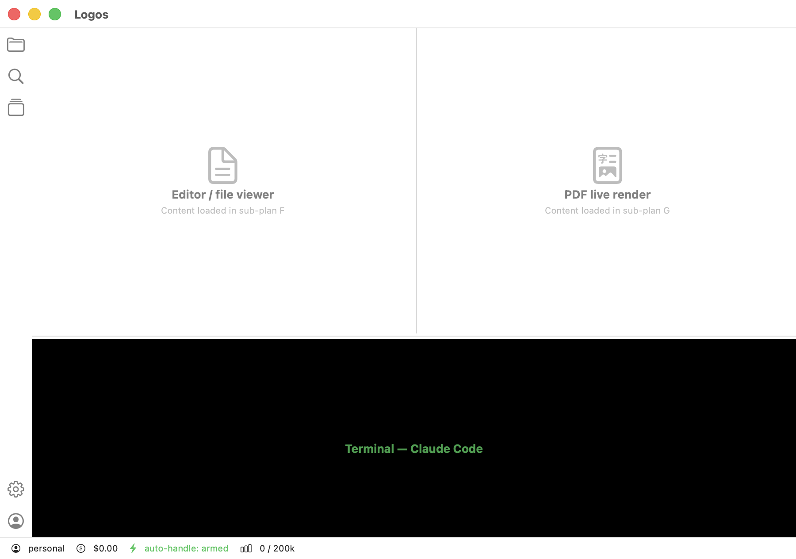

# Logos

> Native macOS app that hosts Claude Code with auto-recovery, multi-account, and zero render tearing.

**Status**: Sub-plan A (app shell foundation) complete ✅ — see [`docs/design/2026-05-25-logos-design.md`](docs/design/2026-05-25-logos-design.md) and [`docs/superpowers/plans/2026-05-25-app-shell-foundation.md`](docs/superpowers/plans/2026-05-25-app-shell-foundation.md)



**Working name**: `Logos` (λόγος — word, reason, rational order). Trademark validation pending.

## Why this exists

Claude Code is powerful but **leaks pain** at the seams:
- Stuck on `Press "keep going" to retry` when rate-limited and you stepped away
- Render flickering as tool calls redraw the terminal
- One terminal, one account — switching accounts is `claude logout && claude login`
- PDF / file output requires alt-tabbing to a separate viewer
- VS Code terminal is shared real-estate with everything else; xterm.js inherits all of the above

Existing solutions (Ghostty, Wave, Warp, VS Code terminal, Cursor agent) each fix **one** of these. None are designed **for Claude Code specifically**. Logos is.

## Architecture in one paragraph

VS Code-like shell (activity bar + file explorer + main area with PDF live-render + bottom terminal panel + status bar). The terminal panel hosts the `claude` CLI as a subprocess via a forked SwiftTerm with a rewritten frame-rate renderer (zero tearing). A stream-tee parses the PTY output to trigger auto-recovery (rate-limit retry, trust-prompt approval, MCP permission rules) and updates the status bar (account, cost, tokens, auto-handle armed/fired). Multi-account via Keychain Services with quick switcher. File explorer + viewer are read-only — editing stays in your real IDE.

## What this is NOT

- ❌ A code editor (no LSP, no IntelliSense — use VS Code/Cursor)
- ❌ A general terminal emulator (designed for `claude`, not for `vim` / `htop`)
- ❌ A Claude API chat client (hosts the CLI, not the API)
- ❌ Cross-platform (macOS only, native Swift)

## Sister project

[`claude-code-logos`](https://github.com/...../claude-code-logos) — plugin marketplace under the same Logos brand. Different repo, same philosophy: science-backed improvements to Claude Code.

## Repo status

**Sub-plan A — App shell foundation: COMPLETE ✅**

- Launchable native macOS app with VS Code-like layout (activity bar + sidebar + main area top/bottom + status bar)
- All panes are placeholders pointing to future sub-plans
- Drag-resize between all panes with persistence (UserDefaults)
- Multi-tab Settings stub (⌘,)
- 18 unit tests passing (3 model suites: WindowLayoutState, ActivityBarSelection, StatusBarViewModel)

**How to run:**

```bash
# Tests
swift test

# Dev launch (window may not activate cleanly without .app bundle)
swift run Logos

# Production launch (proper .app bundle)
swift build -c release
mkdir -p .build/Logos.app/Contents/MacOS
cp .build/release/Logos .build/Logos.app/Contents/MacOS/Logos
cp Info.plist .build/Logos.app/Contents/Info.plist
echo "APPL????" > .build/Logos.app/Contents/PkgInfo
codesign --force --deep --sign - .build/Logos.app
open .build/Logos.app
```

**Next**: sub-plan B — SwiftTerm integration + `claude` subprocess in terminal pane.

Design doc: [`docs/design/2026-05-25-logos-design.md`](docs/design/2026-05-25-logos-design.md)
All plans: [`docs/superpowers/plans/`](docs/superpowers/plans/)

## License

MIT — see [LICENSE](LICENSE).
