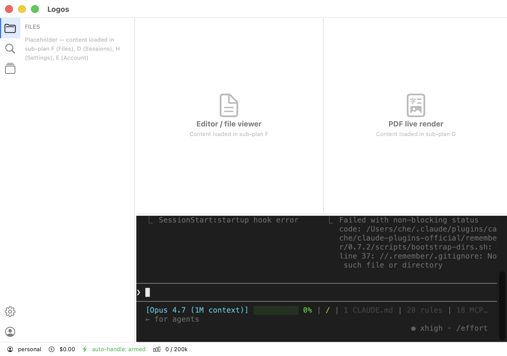

# Logos

> Native macOS app that hosts Claude Code with auto-recovery, multi-account, and zero render tearing.

**Status**: Sub-plans A + B + D complete ✅ — real `claude` CLI runs in native Mac terminal pane, with 5-rule auto-handle intercepting permission/rate-limit/trust prompts.



See [design doc](docs/design/2026-05-25-logos-design.md), [sub-plan A](docs/superpowers/plans/2026-05-25-app-shell-foundation.md), [sub-plan B](docs/superpowers/plans/2026-05-25-swiftterm-claude-host.md), [sub-plan D](docs/superpowers/plans/2026-05-25-auto-handle.md), [sub-plan C.1](docs/superpowers/plans/2026-05-25-renderer-rewrite-c1-fork-harness.md) (partial — see [PR #1](https://github.com/PsychQuant/logos/pull/1)).

**Working name**: `Logos` (λόγος — word, reason, rational order). Trademark validation pending.

## Why this exists

Claude Code is powerful but **leaks pain** at the seams:
- Stuck on `Press "keep going" to retry` when rate-limited and you stepped away
- Render flickering as tool calls redraw the terminal
- One terminal, one account — switching accounts is `claude logout && claude login`
- PDF / file output requires alt-tabbing to a separate viewer
- VS Code terminal is shared real-estate with everything else; xterm.js inherits all of the above

Existing solutions (Ghostty, Wave, Warp, VS Code terminal, Cursor agent) each fix **one** of these. None are designed **for Claude Code specifically**. Logos is.

## Architecture in one paragraph

VS Code-like shell (activity bar + file explorer + main area with PDF live-render + bottom terminal panel + status bar). The terminal panel hosts the `claude` CLI as a subprocess via a forked SwiftTerm with a rewritten frame-rate renderer (zero tearing). A stream-tee parses the PTY output to trigger auto-recovery (rate-limit retry, trust-prompt approval, MCP permission rules) and updates the status bar (account, cost, tokens, auto-handle armed/fired). Multi-account via Keychain Services with quick switcher. File explorer + viewer are read-only — editing stays in your real IDE.

## What this is NOT

- ❌ A code editor (no LSP, no IntelliSense — use VS Code/Cursor)
- ❌ A general terminal emulator (designed for `claude`, not for `vim` / `htop`)
- ❌ A Claude API chat client (hosts the CLI, not the API)
- ❌ Cross-platform (macOS only, native Swift)

## Sister project

[`claude-code-logos`](https://github.com/...../claude-code-logos) — plugin marketplace under the same Logos brand. Different repo, same philosophy: science-backed improvements to Claude Code.

## Repo status

**Sub-plan A — App shell foundation: COMPLETE ✅**
**Sub-plan B — SwiftTerm + claude subprocess: COMPLETE ✅**
**Sub-plan C.1 — SwiftTerm fork + capture/replay harness: COMPLETE ✅** (merged)
**Sub-plan D — Auto-handle: COMPLETE ✅**
**Sub-plan E — Multi-account: INFRASTRUCTURE ⚠️** (real account switching needs E.2 — see [retrospective](docs/sub-plan-e-retrospective.md))

- Launchable native macOS app with VS Code-like layout (activity bar + sidebar + main area top/bottom + status bar)
- **Real `claude` CLI runs as PTY subprocess in terminal pane** (SwiftTerm 1.13, theme `Menlo 13pt` dark `#1e1e1e` / `#d4d4d4`)
- **5-rule auto-handle**: rate-limit "keep going", trust folder, trust files, Bash permission, Press Enter — all auto-approved per-rule with 5s cooldown + runaway-disable (3 fires in 30s → rule auto-disables, status bar turns yellow)
- `--dangerously-skip-permissions` removed; claude asks normally, `AutoHandleEngine` answers per-rule
- **Multi-account UI + model + Keychain store** (⌘K opens switcher sheet) — but switching active account does NOT yet change which claude account runs, because modern Claude Code stores OAuth in macOS Keychain at `Claude Code-credentials/$USER` not in `~/.claude/.credentials.json`. Sub-plan E.2 will add real Keychain-swap mechanism.
- Drag-resize between all panes with persistence (UserDefaults)
- Multi-tab Settings stub (⌘,)
- **60 unit tests passing** in 11 suites (WindowLayoutState, ActivityBarSelection, StatusBarViewModel, TerminalConfig, ClaudeProcessConfig, AutoHandleRule, AutoHandleEngine, PatternParser, Account, AccountCredentialStore, AccountManager)
- Tearing/flicker still inherited from upstream SwiftTerm — fix lives in sub-plan C.2+ (renderer rewrite)
- claude not in `$PATH`? App shows `ClaudeNotFoundBanner` with install link
- No active account? App shows `NoActiveAccountBanner` directing to status bar

**How to run:**

```bash
# Tests
swift test

# Dev launch (window may not activate cleanly without .app bundle)
swift run Logos

# Production launch (proper .app bundle)
swift build -c release
mkdir -p .build/Logos.app/Contents/MacOS
cp .build/release/Logos .build/Logos.app/Contents/MacOS/Logos
cp Info.plist .build/Logos.app/Contents/Info.plist
echo "APPL????" > .build/Logos.app/Contents/PkgInfo
codesign --force --deep --sign - .build/Logos.app
open .build/Logos.app
```

**Next**:
- Merge [PR #1](https://github.com/PsychQuant/logos/pull/1) (sub-plan C.1) into main after review
- Collect remaining baseline captures (plan mode / rate-limit / permission) organically
- Sub-plan C.2 — frame-rate renderer (the moat work begins)
- Sub-plan E — multi-account Keychain switcher (independent of C)

Design doc: [`docs/design/2026-05-25-logos-design.md`](docs/design/2026-05-25-logos-design.md)
All plans: [`docs/superpowers/plans/`](docs/superpowers/plans/)

## License

MIT — see [LICENSE](LICENSE).
